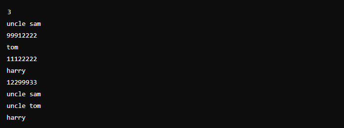
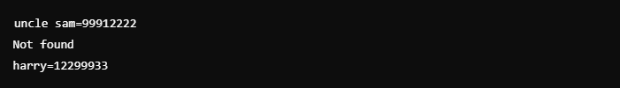

# Livro de telefone

Este repositório trata de um desafio de código envolvendo um livro de telefones que associa nomes de pessoas a números de telefone. Após construir o livro com base nas entradas fornecidas, você deverá responder a consultas, fornecendo o número de telefone associado ao nome pesquisado ou informando que não foi encontrado.

### Formato de Entrada:
- A primeira linha da entrada contém um número inteiro que representa a quantidade de entradas no livro de telefones.
- Para cada entrada, você recebe:
  * O nome da pessoa (em uma ou duas palavras, sempre em letras minúsculas).
  * O número de telefone dessa pessoa (sempre com 8 dígitos).
- Após as entradas, você receberá uma lista de consultas, onde cada consulta contém o nome de uma pessoa. Essas consultas vão até o fim do arquivo (EOF - End Of File).
### Restrições:
- Os nomes são compostos apenas por letras minúsculas e podem ter um ou dois componentes (por exemplo, "uncle sam" ou "tom").
- Cada número de telefone tem exatamente 8 dígitos, sem zeros à esquerda.
### Formato de Saída:
- Para cada nome pesquisado:
  * Se o nome existir no livro de telefones, você deve imprimir o nome seguido de "=", e o número de telefone (por exemplo, "uncle sam=99912222").
  * Se o nome não for encontrado, imprima "Not found".
### Exemplo de Entrada:

###
Exemplo de Saída:

